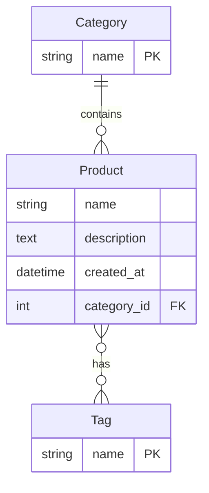

# Storefront Catalog

## Setup Instructions

1. **Create a virtual environment** (optional but recommended):
   ```bash
   python -m venv .venv
   source .venv/bin/activate
   ```
2. **Install dependencies**:
   ```bash
   pip install -r requirements.txt
   ```
3. **Apply database migrations**:
   ```bash
   python storefront/manage.py migrate
   ```
4. **Seed the database with sample data**:
   ```bash
   python storefront/manage.py seed_catalog
   ```
5. **Run the development server**:
   ```bash
   python storefront/manage.py runserver
   ```

After the server starts, visit `http://127.0.0.1:8000/catalog/` to view the product catalog.

## Design Decisions and Future Work

One of the main constraints was time in this project, which is why I decided to only allow for one tag filter and one category filter at a time. Additionally, the search functionality is fairly basic, and does not implement full text search. In future work, I would add a package for better search, explored STF5 within SQLite, or gone with a PostgreSQL system. The application is only a single Catalog page for the sake of simplicity, which allows the user to search and filter on the single page.

Tests are also implemented, which are AI generated based on the view logic.

## AI Usage
I developed the form logic, Q-object filters, and data model from scratch, then used ChatGPT to polish the model, templates, and styling; Cursor was employed only occasionally to debug the form integration.

AI tooling occaionally helped rewriting the view to fit into my form, but I am confident that I own the logic and AI was used mostly with syntax help.

Codex helped create the requirements.txt and seeding file in order to help you run the same environment that I developed with.

## Data Model

(mermaid diagram generated by AI from models in code)


### Model Relationships

- **Category**: A category can have multiple products (one-to-many relationship)
- **Product**: Each product belongs to one category and can have multiple tags
- **Tag**: Tags can be associated with multiple products (many-to-many relationship)

### Fields

- **Category**

  - `name`: Unique string identifier for the category

- **Product**

  - `name`: Product name
  - `description`: Detailed product description
  - `category`: Foreign key to Category
  - `tags`: Many-to-many relationship with Tag
  - `created_at`: Timestamp of when the product was created

- **Tag**
  - `name`: Unique string identifier for the tag


