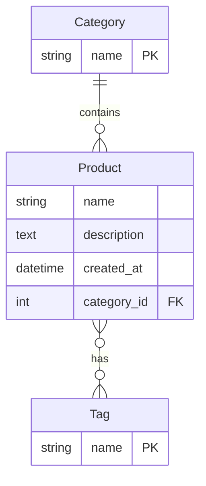

# Storefront Catalog

## Data Model

### Model Relationships

- **Category**: A category can have multiple products (one-to-many relationship)
- **Product**: Each product belongs to one category and can have multiple tags
- **Tag**: Tags can be associated with multiple products (many-to-many relationship)

### Fields

- **Category**

  - `name`: Unique string identifier for the category

- **Product**

  - `name`: Product name
  - `description`: Detailed product description
  - `category`: Foreign key to Category
  - `tags`: Many-to-many relationship with Tag
  - `created_at`: Timestamp of when the product was created

- **Tag**
  - `name`: Unique string identifier for the tag
